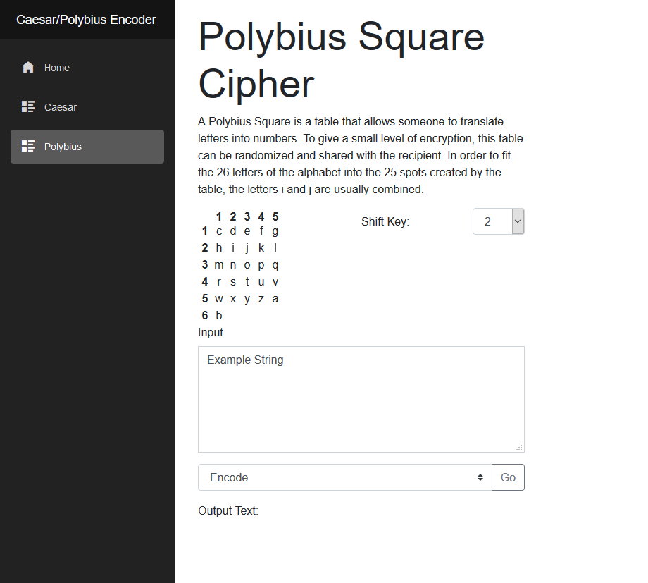

# Cipher Encoder/Decoder App Built With [Blazor](https://blazor.net/)

Blazor is an experimental .NET web framework using C# and HTML that runs in the browser.

## Demo
[caesar-polybius-cipher.netlify.com](https://caesar-polybius-cipher.netlify.com)

## Installation
Folow the instructions on [Blazor Get Started](https://blazor.net/docs/get-started.html) page and install all the dependencies required to run blazor. Make sure to change the sdk version in globals.json if your installed one have a different version, otherwise there will be an 502.5 HTTP error.